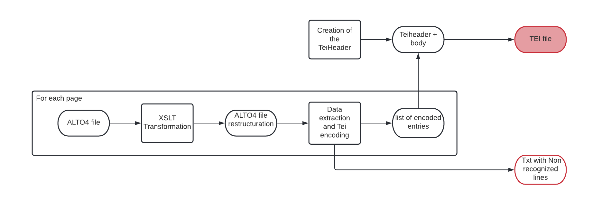
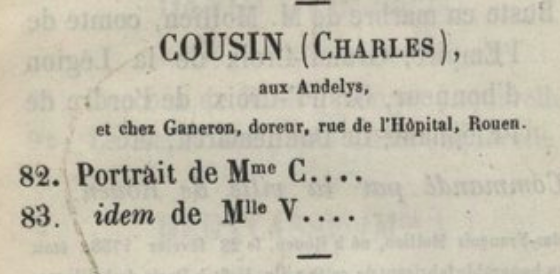

exp# extractionCatalogs : Python data extractor for exhibition catalogs

Python script which transforms Alto4 transcription files into XML-TEI encoded catalogs.</br>
For an exemple of data produced using this script, see [here](https://github.com/Juliettejns/TEIcatalogs).

## How it works
<div align="justify">
   
   <p class="float" align="center">
      
   </p>
   
   Since the transcription of the exhibition catalogs pages are done along to its layout analysis, entries are described in the alto4 file. Therefore, we are able, for each entry, to get, using regular expressions, the author, its biographic informations and each items created by the author. To do that, we need to divide exhibition catalogs according to their entries' typology: 

   
   1. Null: An entry is composed of the name of the author and the different items.<br/>
   2. Simple: Each line of the entry contains an precise element: author, biographic informations, item's title and other informations.<br/>
   3. Double: The author and his biographic informations are on the same line. Item's title and its other informations are on two separated lines.<br/>

   <p class="float" align="center">
      
      
      
   </p>
Left to right: Entry Null, Entry Simple and Entry Double 
   <br/>
   
The regular expressions are instancied in the ```regex_instanciation.py``` file. Various regular expressions have been created in order to match with most of the exhibition catalogs. Therefore, it is needed, before using the python script, to check this file and verify that the activated regular expressions match the processed catalog.
   
The script output is a XML-TEI file which combines all the Alto4 transcriptions and sticks to the [ODD](https://github.com/carolinecorbieres/ArtlasCatalogues/blob/master/5_ImproveGROBIDoutput/ODD/ODD_VisualContagions.xml) done by Caroline Corbières. The ```Teiheader``` is not completed. 
   

</div>
 
## How to use the repository
  - Clone the repository: ```git clone https://github.com/Juliettejns/extractionCatalogs```
  - Create virtual environment: ```virtualenv -p python3 env```
  - Run the virtual env: ```source env/bin/activate```
  - Install the requirements: ```pip install -r requirements.txt```
  - Check the regex used in the `fonctions/instanciation_regex.py` file
  - Run the program: `python3 run.py ./path/to/directory_with_images_or_altos title_Catalogue_date type_of_catalog name_output`</br>
If you want to have images as your input, you need to add the option `-st` at the end of the command. It segments and transcribes your data.</br>
If you want to have your alto files verified (recommanded), you need to add the option `-v` at the end of the command.
  - Choose the type of catalog you are processing
  - Stop the virtual env: ```source env/bin/deactivate```

## Repository

```
├── fonctions
│     ├── automatisation_kraken
│     │     ├─ automatic_kraken.py
|     |     ├─ model_ocr.mlmodel
│     │     └─ model_segmentation.mlmodel
│     │ 
│     ├── creationTEI.py
│     ├── restructuration_alto.xsl
│     ├── restructuration.py
│     ├── creationEntreeCat.py
│     └─ instanciation_regex.py
|
├── tests
│     ├── out
│     │     └─ ODD_VisualContagions.rng
│     ├── ODD_VisualContagions.xml
│     └─ test_Validation_xml.py
|
├── images
├── README.md
├── requirements.txt
└─ run.py
```

## Credits
This repository is developed by Juliette Janes, intern of the [Artl@s](https://artlas.huma-num.fr/fr/) project, with the help of Simon Gabay under the supervision of Béatrice Joyeux-Prunel.

## Thanks to
Thanks to Simon Gabay and Claire Jahan for their help and work.

## Licence
The code is CC-BY.</br>


## Cite this repository
Juliette Janes, Simon Gabay, Béatrice Joyeux-Prunel, _extractionCatalogs: Python data extractor for exhibition catalogs_, 2021, Paris: ENS Paris https://github.com/Juliettejns/TEIcatalogs/

## Contacts
If you have any questions or remarks, please contact juliette.janes@chartes.psl.eu and simon.gabay@unige.ch.

