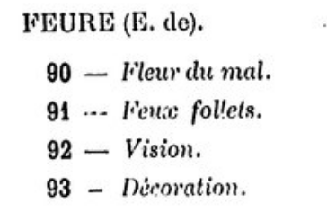
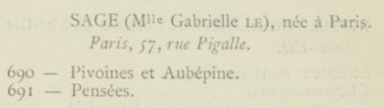

# extractionCatalogs : data extractor for 19th and 20th centuries art exhibition catalogs 

This two step pipeline (eScriptorium + python script) aims to create TEI encoded art exhibition catalogs and CSV tables containing their data.

After an automatic/manual transcription with eScriptorium OCR (optical carachter recognition), the user will use the python script contained in this repository. It contains a Jupyter notebook file which serves as an interface for executing it. 

You may find complete and detailed instructions in the ```Guide - extraction de catalogues.ipynb``` file

## inputs/outputs
<br>eScriptorium</br> 

- input : iiif manifest or pdf, jpeg, png, etc. 

- output : XML ALTO files

<br> python script : </br> 

- input : XML ALTO files produced by eScriptorium

- output : XML TEI and CSV files

The script output is a XML-TEI file which combines all the ALTO transcriptions and sticks to the [ODD](https://github.com/carolinecorbieres/ArtlasCatalogues/blob/master/5_ImproveGROBIDoutput/ODD/ODD_VisualContagions.xml) done by Caroline Corbières. 

The ```/exemples_output``` directory contains examples of data produced by this pipeline.
   
   <p class="float" align="center">
      
      
      
   </p>
   
## Instructions 

### eScriptorium


</div>
 
## Installation
  - Clone the repository: ```git clone https://github.com/Juliettejns/extractionCatalogs```
  - Create virtual environment: ```virtualenv -p python3 env```
  - Run the virtual env: ```source env/bin/activate```
  - Install the requirements: ```pip install -r requirements.txt```
  - Check the regex used in the `fonctions/instanciation_regex.py` file
  - Run the program (previously): `python3 run.py input_dir output_dir catalogue_title -st`

If you want to have images as your input, you need to add the option `-st` at the end of the command. It segments and transcribes your data.</br>
  - Stop the virtual env: ```source env/bin/deactivate```

## Repository


## Credits
This repository was first developed as a prototype by Juliette Janes in 2021. The project was further augmented by Esteban Sánchez Oeconomo in 2022.

Both former students in Digital Humanities at Paris Science-Lettres University and interns of the [Artl@s](https://artlas.huma-num.fr/fr/) 
project worked under the direction of Simon Gabay and Béatrice Joyeux-Prunel.


## Licence
The code is CC-BY.</br>


## Cite this repository
Juliette Janes, Esteban Sánchez Oeconomo, Simon Gabay, Béatrice Joyeux-Prunel, _extractionCatalogs: Python data extractor for exhibition catalogs_, 2022, Paris: ENS Paris https://github.com/Juliettejns/TEIcatalogs/


## Contacts
If you have any questions or remarks, please contact juliette.janes@chartes.psl.eu, esteban.sanchez.oeconomo@chartes.psl.eu or simon.gabay@unige.ch.

